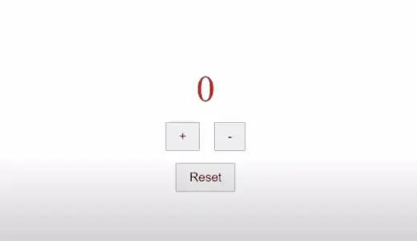

# Count Component mit Styled-Component stylen

1. Dein Haupt-Component muss hoch-, runterzählen und auf `0` alles setzen(reset), dafür implementierst du:

   - 3 Buttons(increase, decrease, reset)

2. Mithilfe des Buttons wird nur bis `0` gezählt werden.
3. Style deine App mit `styled-Components`dein:
   - Container
   - Display für die Ausgabe
   - Display für deine Buttons
   - Deine Buttons

# Grafik

